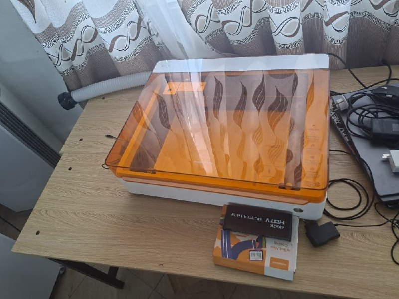
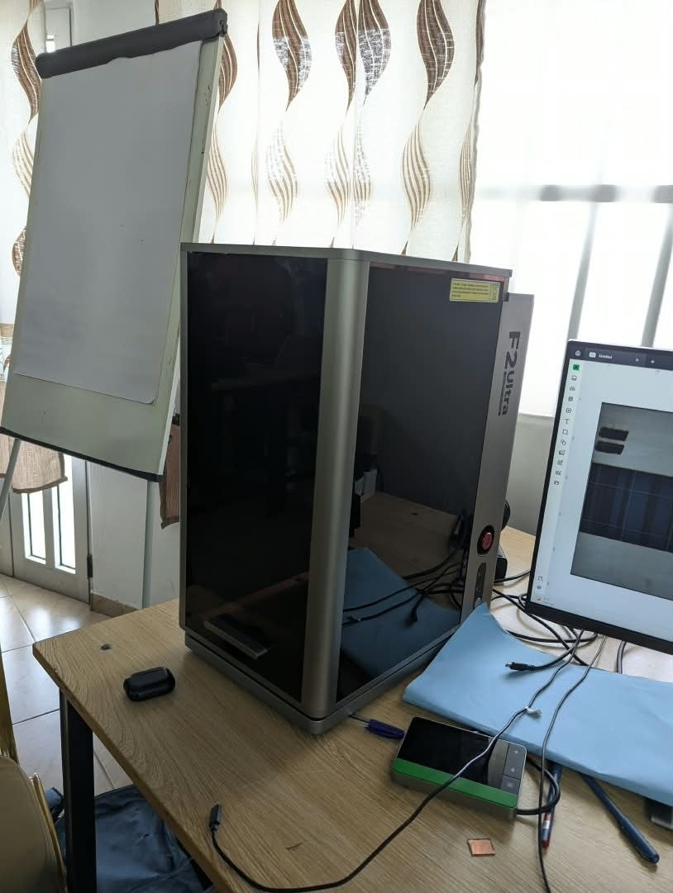
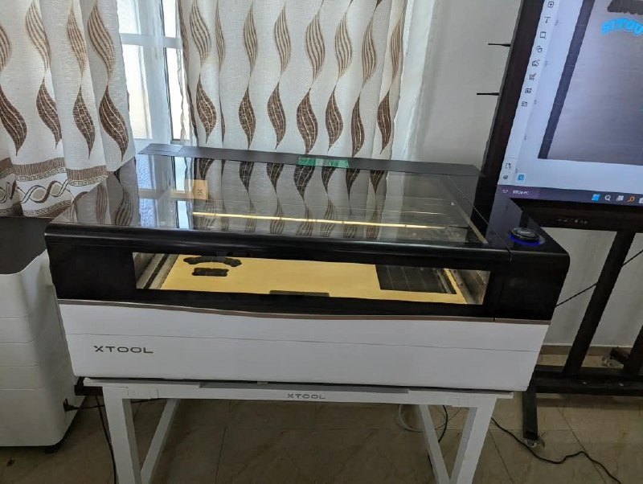
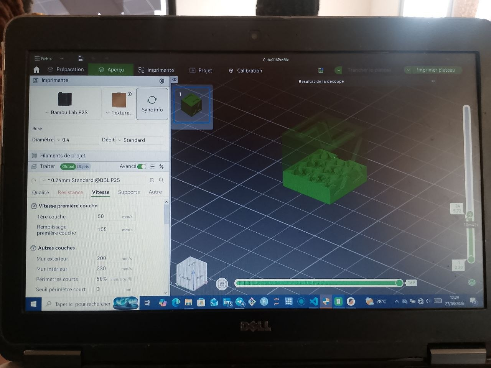
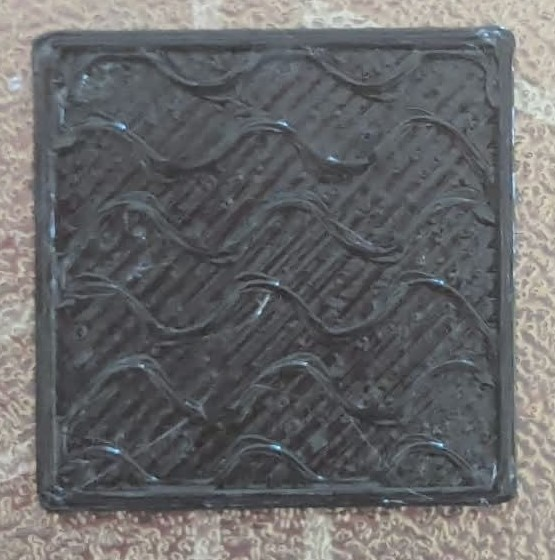

# Journal du 26 Août 2026 (rédigé par : AKINRIMADE Rebecca)

## Fait aujourd'hui
- Découverte des différents types de machines et de leur fonctionnement.
- Présentation des types de microcontrôleurs

- Initiation au Découpe Laser

- Initiation à l'électronique

- Initiation à la fabrication additive

## Appris

- **Prototypage**: Découverte des cartes XIAO ESP32S3

- **Découpe laser**
    - Familles de lasers industriels: CO2, Fibre, Diode, UV.
    - Choix d'une machine est basé sur le besoin et le matériau
    - Normes de sécurité : Classe 60825-1
    - Machines variantes : Xtool F2 Ultra, P3, MétalFab M1Ultra.
    - Exercice pratique: Gravure de Nom avec l'outil Xtool P3
- **Atelier électronique**
    - Grandeurs fondamentales : Tension, Courant, Résistance.
    - Utilisation du multimètre comme outils de mesure
    - Travaux pratique: Mesurer la tension AC et le résistance sur 2 piles.
- **Atelier Impression 3D**
    - Fabrication additive: vue d'ensemble sur l'historique et les principes de l'impression 3D
    - Technologies : les plus utilisés sont FDM et SLA
    - Choix du filament et son parcours dans l'imprimante

# Raté, puis corrigé

- Néant

## Décidé

- M'exercer le jour au jour avec le logiciel Xtool, Revoir mon cours d'électronique.