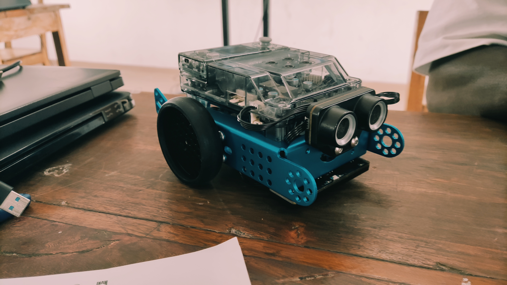
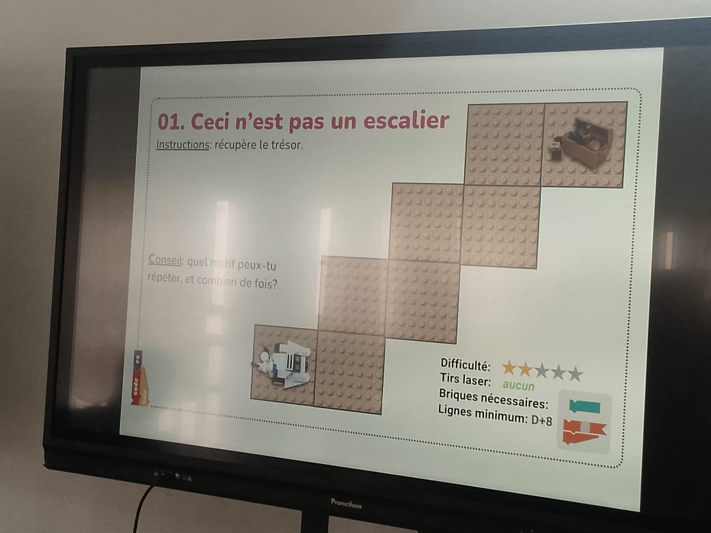
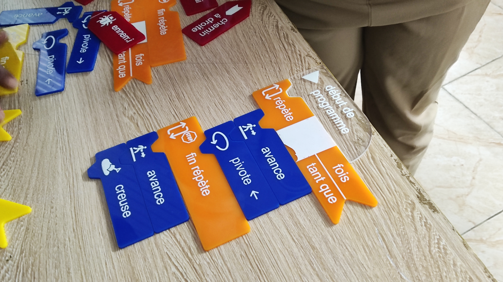

# Journal — mercredi 02 Septembre 2026 (rédigé par : AKINRIMADE Rebecca)

## Fait aujourd'hui
- Atelier électronique : Montage robot Mbolt2 - Programmer le robot pour le faire avancé - programmer le robot à éviter les obstacles

- Atelier de Découpe laser: Algorithme

- Atelier projet

## Appris

**Atelier électronique**
- Monter les différents pièces pour concevoir le robot Mbolt2 (Tutoriel)
- Programmer le robot Mbolt2 avec le logiciel mblock 

**Atelier découpe laser**

**1. définition d'un algorithme** 
"une séquence finie et non ambiguë d'instructions, permettant d'accomplir une tâche spécifique ou de résoudre un problème."
**2. Les 3 critères qui définissent un algorithme**

- Une suite ordonnée d'instructions
- Un nombre fini d'étapes
- Des instructions précises, qui résolvent un problème 

**3. Algorithmique débranchée**

- Définition : Méthode d'apprentissage qui permet de comprendre les bases de la programmation et de la logique informatique sans utiliser d'ordinateur, de tablettes ou d'écran
- Support utilisé : Cartes physiques type Code.org pour programmer un robot
- Couleurs des cartes : Bleu = Action [avance, pivote, tire, creuse], Jaune = Condition [si, sinon, fin si], Orange = Boucle [répète, fin répète], Rouge = Événement/Objet [ennemi, trésor]

**4. Exercice pratique**

- **Objectif** : Programmer un robot pour récupérer le trésor
- **Contrainte** : Trouver un motif à répéter. Difficulté 1 étoile
- **Solution logique** : Utiliser une boucle "répète" pour avancer + pivoter et monter les marches

**Atelier Projet** : réalisation de la maquette sur papier avec définition des dimensions de la maquette des routes.

## Raté, puis corrigé

- Néant

## Décidé

-Mettre en pratique tous les exercices faites aujourd'hui 

## À faire demain

- [Action] — Prénom
- [Action] — Prén