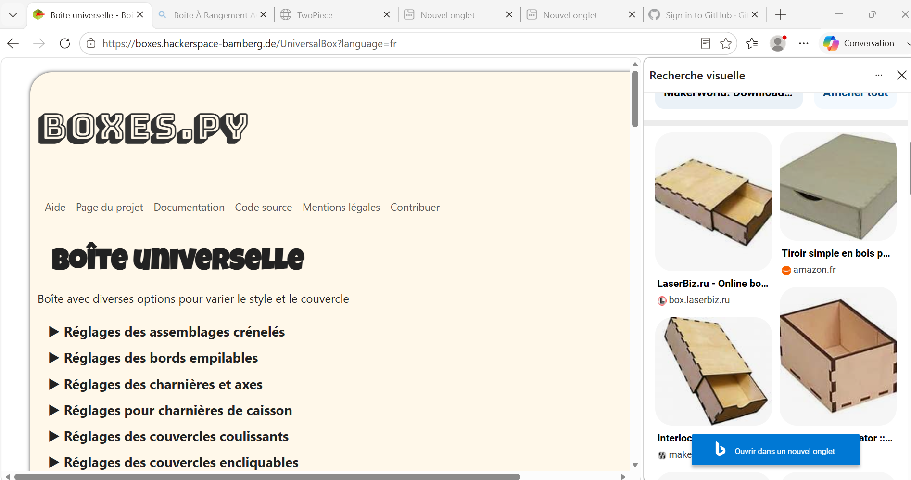

# Journal — Jeudi 10 Septembre 2026 (rédigé par : AKINRIMADE Rebecca)

## Fait aujourd'hui

- **Le projet** 
    - Impression DTF de la maquette représentant le carrefour

    - Conception du plan de la maquette permettant l'assemblage par soudure des panneaux de contreplaqué, pour un format final de 60 x 60 cm

    - Montage du circuit test sur breadboard SK-10

    - Calcul des dimensions des pièces à l'aide de l'outil en ligne Boxes.py

    - Découpe laser des contreplaqués destinés à l'assemblage
    
 ## Appris

- Utilisation de l'outil Boxes.py
- Techniques d'impression DTF

## Raté, puis corrigé

- Interruption des impressions DTF liée à l'absence de nettoyage automatique de la machine ; problème identifié et corrigé

## Décidé

- continuer la conception du projet groupe 4

## À faire demain

- Assemblage des pièces découpées au laser pour constituer le support de base — Groupe 4
- Montage du circuit et écriture du programme pour piloter l'allumage des LED selon la logique du feu tricolore — Groupe 4
- Le Groupe 4 s'occupera demain de l'assemblage des pièces découpées au laser pour constituer le support de base, ainsi que du montage du circuit et de l'écriture du programme permettant de piloter l'allumage des LED selon la logique du feu tricolore.
