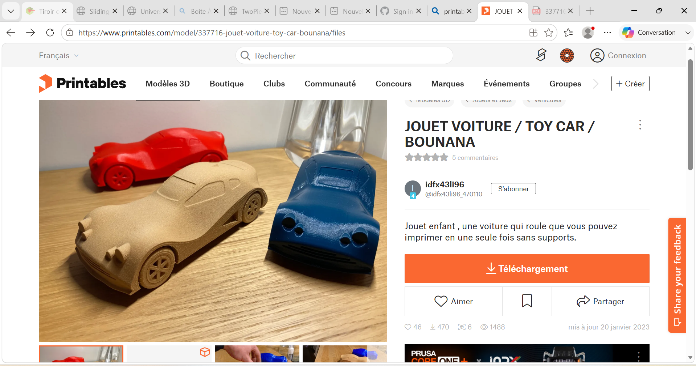
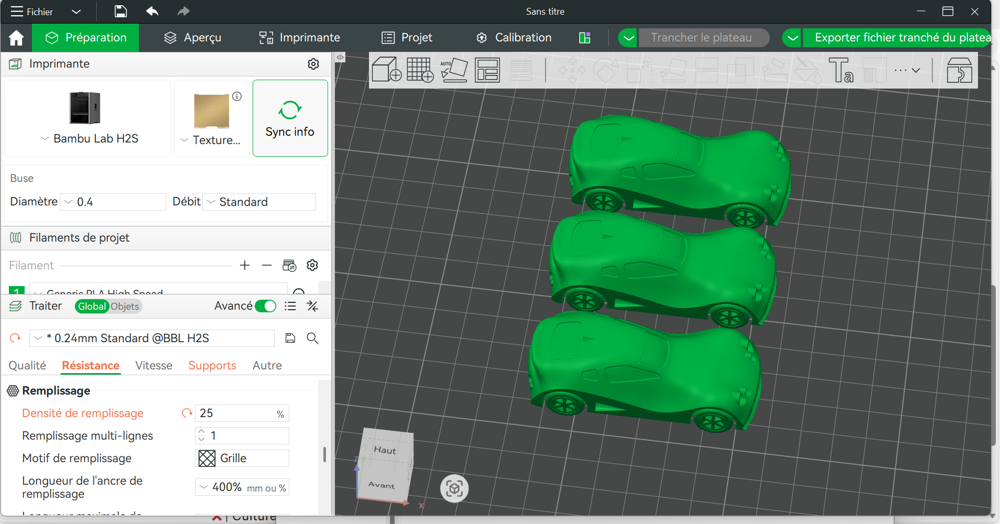
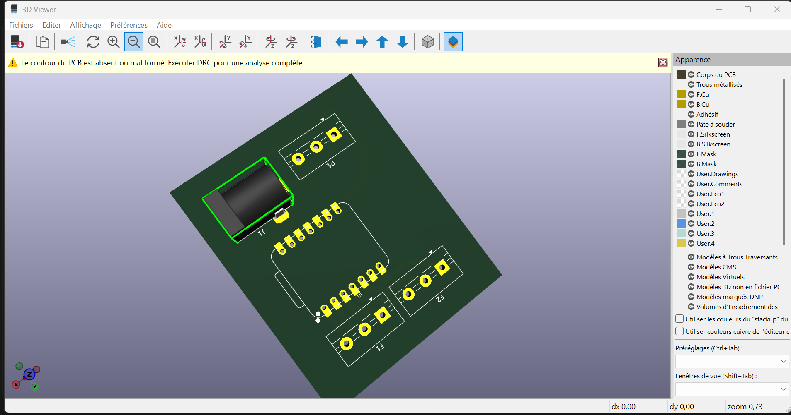

# Journal — Samedi 12 Septembre 2026 (rédigé par : AKINRIMADE Rebecca)

## Fait aujourd'hui

**Projet**
Cette journée a été consacrée à plusieurs volets du projet, plus spécifiquement:
- une recherche a été menée sur la plateforme Printables afin de trouver un modèle 3D de voiture déjà prêt à l'impression, évitant ainsi de le modéliser entièrement à partir de zéro. 

- En parallèle, Ce modèle a ensuite été tranché dans BambuStudio, c'est-à-dire préparé et découpé en couches d'impression pour être envoyé à l'imprimante 3D. 

- Enfin, le travail sur le PCB du projet s'est poursuivi avec sa conception.

## Appris

Le travail du jour a permis d'acquérir de nouvelles compétences techniques. D'une part, la manipulation du logiciel BambuStudio pour ajuster les dimensions d'un modèle 3D avant impression — une étape essentielle pour s'assurer que la pièce corresponde exactement aux besoins du projet une fois imprimée. D'autre part, la conception et le câblage du circuit imprimé (PCB) sur KiCad, ce qui implique de positionner les composants électroniques sur la carte et de tracer les connexions électriques entre eux de manière fonctionnelle et cohérente.

## Raté, puis corrigé

Une difficulté est survenue lors du choix des composants dans KiCad : certains composants sélectionnés ne correspondaient pas aux besoins réels du circuit, ce qui a également entraîné des erreurs dans la connexion entre eux. Ce problème a nécessité une révision du choix des composants ainsi qu'une correction du câblage pour rétablir une liaison correcte entre les différents éléments du circuit.

## Décidé

Aucune décision spécifique n'a été mentionnée pour cette journée.

## À faire demain (Groupe 4)

- Impression 3D  de la voiture
- Impression du PCB
- Réalisation d'un boîtier pour le système central